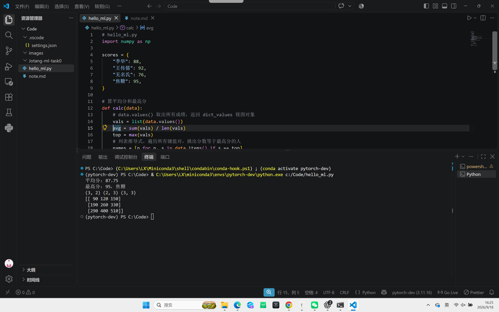

# ML学习笔记

**申明笔记并未采取一问一答的模式，借助了视频学习，以及ai查询资料，按照自己的思考过程进行学习记录**

## 人工智能、机器学习与深度学习之间有什么关系？

### 引入

通过资料的学习，我觉得我们应该先回答一个问题

## **为什么我们需要机器学习？**

编写一个电商程序，实现商品展示与购物车功能,但如何识别用户的偏好意图并且做出精准的推荐？编写一个相册，可以收集用户拍照/保存的图片，但如何进行图像的分类?自动帮用户区分人物/风景/猫猫编写一个客服程序，根据用户输入内容关键词回复预设的”死内容”,但对于超出范围的问题，如何回答？所以我们需要机器学习

**对于人类来说**

看到一张照片，我们能判断这是猫还是狗

听到一个人的语气/看一个人的表情我们能大概判断他是开心、紧张还是生气

**人类可以轻松地对很多事情进行判断和预测**

**但人类自身至今也无法具体讲清楚其中的准确计算逻辑**

而机器学习和我们有相似的地方

## **什么是机器学习？**

**是一类可以从经验中学习的技术，让计算机从数据中自动学习规律，并基于这些规律进行预测或决策，而无需明确编程所有规则，让计算机通过“经验数据”（训练数据）学习并获得“识别规律”的能力**

生活中处处都是ML

语音识别Siri,手机解锁,人脸识别,输入法智能联想,B站/淘宝/抖音推荐,网易云/QQ音乐歌单,导航软件计算时间

## **如何实现机器学习**

**我们可以从我们怎么学来看机器怎么学**

**以下是机器学习的几个重要部分**

### **1.数据**

我们解一元二次方程题x²+5x+6=0，刷过很多题，用过很多次，而每道题就像一个训练样本（**训练数据集**）

**概念** 

数据其实是一组个体（样本））所具有的特征与结果，遵循独立同分布（非必要），样本有时也叫做数据或者数据实例，样本：一张图片、一段文字、一位病人、一次交易记录多个样本组成了数据集

样本一般包含两个部分

**特征**（feature）：**机器可以用来“做判断”的输入**，例如身高、年龄、图像像素等；

**标签**（label）：**我们希望机器“预测”的结果**，例如房价、是否患病、图像是狗还是猫

当每个样本的特征数量一致时，就形成了一个固定维度（dimensionality）的数据集

数据集形状=**样本数×特征维度****（n×d）**

### **就像excel表格一样**

数据要用数学表示（**矩阵，张量，线性代数**）

比如一个学生有3个特征：身高=170  体重=60  年龄=18

x=[170,60,18] 三维向量

维度就是特征,**特征越多，维度就越多**

图像的数据
**矩阵**

### **向量**

**极其重要，用向量可以表示非常多的信息，数据被极大地压缩**

**在空间间中用两个点的距离来表示二者的相似性**

**比如淘宝的算法推荐**

**大模型的每一层神经元都是千亿维**

### **模型参数**

**每一个参数都是一个神经元，都是一个特征**

在机器学习中，数据集常会被分为：

### **训练集**：模型用来“学”的（生成模型）

### **验证集**：模型用来“选”的（选择模型）

### **测试集**：模型用来“考”的（最终性能）**就像高考题不能被泄露**

**gabage in gabage out **

**数据的质量比数量重要**

### **2.模型**

你学习到了：看到二次项系数是1，我可以用因式分解法，对你来说，这就是你构建的“**解题模型**”：输入题目，脑海中处理一番，输出答案

**概念**

模型的本质就是从输入到输出的一种**转换关系（映射）**

图像输入→情绪输出，传感器读数→正常/异常

模型可以很简单（线性），也可以非常复杂（神经网络）

之前浙大搞过一个研究

题目：中国人幸福吗？

输入：10W个样本，每个样本有56个维度和一个标签输出：幸福指数=参数1*维度1+参数2*维度2+....+偏置量“拉一条线”来拟合数据

**复杂问题、情绪识别层层抽象、层层数据转换，其实就是深度学习**

## 这就回答了什么是深度学习

## **神经网络**

神经网络的基本组成 

**层：输入层 隐藏层 输出层**

**神经元**

**权重**

**偏置**

**激活函数**

神经网络中每个神经元的计算过程分为两步

#### **线性变换**

把输入向量x和权重向量w做**内积**加偏置

z=w*x+b  

w和x是矩阵向量

#### **非线性激活**

把上一步的结果z输入**激活函数**f(z)

**作用引入非线性，提取抽象的信息**

最常见 **Relu(x)函数  sigmoid函数**

**线性层负责拉伸、旋转、平移空间，激活函数负责掰弯空间，多层网络反复拉伸、掰弯，最终就能形成复杂的分类边界**

每个神经元的计算结构是：输入→加权和→激活函数→输出

**而深度即是神经网络的层数**

模型一开始是“空的”，**参数随机**，我们用数据“教它”，什么输入该对应什么输出，它会“调整自己”（**优化参数**），越来越接近我们想要的输出

### **训模型其实就是猜参数，那我们应该往那个方向猜呢，我们需要目标函数**

### **3.目标函数**

**模型优劣程度的度量，度量可优化**

如果你练习100道题，有90道对、10道错，你就知道你还有进步空间每错一道题扣一分这就是你的“**损失函数**”，损失函数和目标函数是一件事

### **损失函数**

实际值与期望值之间的偏差

最常用的损失函数

**$ \mathcal L=\frac1N\sum_{i=1}^N(y_i-\hat y_i)^2 $**

二分类 我们用交叉熵损失函数

**训练模型**

不是“胡乱学”，而是不断让损失函数的值更好（通常更低）每次错一点，就罚一点；错得越多，罚得更多（平方惩罚）数学上可导、可优化惩罚大误差（错得离谱会被惩罚更多）输出连续数值时非常常用（回归任务）

损失函数的值是**模型预测结果与真实标签之间的差异**，但这个差异是在一组特定的数据集上计算的，所以它依赖于数据集本身

你让模型背答案，它确实会“零错误”，训练集就像是模拟题本，你天天做它，测试集就像是期末考试题，你之前没见过，损失函数计算的是“表现”，但表现好≠懂得好，只有在看不见的数据也表现好，才是真的学会了，这里我们就引出了**过拟合**

### **过拟合**

一个模型在训练集上表现良好，但不能推广到测试集，这个模型被称为过拟合，模型的泛化能力比较弱

## **ps：在ai时代，泛化能力很重要**

**如何防止过拟合**   **正则化**：

使用验证集+提前停止训练（EarlyStopping）在训练过程中，用一部分未参与训练的数据（验证集），定期测试模型表现，如果发现验证集性能连续多轮不再提升，就停止训练模型，训练第10轮时在验证集表现最好，到第15轮反而下降，就选第十轮

或者对训练集的数据做随机变换或扰动，生成“新”数据，让模型“见多识广”，尤其适用于图像、语音、文本任务翻转、旋转、缩放、剪裁、亮度变化等

**欠拟合**：模型连训练集都学不好，在训练集上误差就很高，测试集误差也高。模型太简单，没捕捉到数据底层规律

### **4.优化算法 优化器**

做错题后，你回看解析，发现自己老看错负号，于是你提醒自己以后注意或者你发现“根公式不熟”，于是反复背诵**调整自己的思维策略**（也就是模型参数）来减少错误率

####  **梯度下降**

$$
\theta := \theta - \eta \cdot \nabla J(\theta)
$$

是最核心、最常用的优化算法，每次往“**损失函数下降最快的方向**”走一步，直到找到了**最低点**

**求偏导**   斜率，下降最快的方向

**学习率**   走的步幅

#### 批量梯度下降

#### 随机梯度下降

#### 小批量梯度下降

**batch sixe**:一次梯度更新时，用来计算损失和梯度的样本数量

## Adam 算法

会记录每个参数历史上的：一阶梯度的“平均方向”（像惯性）二阶梯度的“方差”（调整步长）学得快的参数→步子小点，避免抖动学得慢的参数→步子大点，加快学习

99%的深度学习模型默认都在用Adam，无需精调学习率，收敛速度快，对抖动/震荡问题表现良好

## 反向传播算法计算梯度

神经网络是一层套一层的函数，损失函数只有一个，在最后的输出发挥作用

直观的感受是，损失函数可以计算出最后一层的梯度，那倒数第二层呢？倒数第三层呢？

**求导的链式法则**
$$
\frac{\partial L}{\partial W} = \frac{\partial L}{\partial y} \cdot \frac{\partial y}{\partial z} \cdot \frac{\partial z}{\partial W}
$$

## 监督学习
数据有标签（答案）

在给定输入特征的前提下，预测相应的输出标签，比如预测类别

典型算法

逻辑回归LR、感知机、决策树、SVM、K近邻KNN、神经网络DNN、CNN

## 无监督学习
数据没标签（聚类）

**简单来说**

**就像是给你一堆题，但不告诉你正确答案，做完很多题后，不能得出正确答案，但可以大致清楚哪些题是一类**

数据没有人为标注的标签，模型需要自己从数据中发现结构，模式或规律

老师给你发了本次考试的结果和你的答题卡，问你“你觉得自己有什么问题？

”男/女朋友向你提出灵魂之问：你觉得自己错在哪了？

没有标准答案，模型要自己从数据中“学会看门道”

### **但无论有无监督本质上都是离线学习**

模型不会主动去影响环境或采集新数据，模型只是从固定数据中“学习模式”
## 强化学习

让一个智能体（Agent）通过与环境不断交互、试错，从奖励信号中学习如何做出最优决策
## 马尔可夫性

未来的状态只取决于当前状态，而与更早的历史无关
## softmax回归与线性回归区别

线性回归做的是“预测一个数值”，Softmax 回归做的是“判断属于哪一类”
线性回归：输出连续值，用 MSE 训练，解决回归问题
Softmax 回归：输出类别概率，用交叉熵训练，解决多分类问题
两者共享“线性打分”的思路，区别主要在输出层和损失函数

softmax  把线性打分（logits）转换为概率，数值相加之和为一
## 多层感知机MLP
多层神经网络就像是一个特征构建工厂，每一层都能学出新的，对任务更有用的表示，只要有足够多的隐藏单元，MLP可以逼近任意连续函数（映射）
**我们真实的世界是极其非线性的**

### “隐藏层”到底隐藏了什么

**隐藏层不是故意藏起来的层，而是它不直接对应最终答案，它负责把原始输入加工成更有用的中间特征**

------
## 程序的运行命令与结果截图

### 1. 为什么不同项目最好使用不同的 Python 虚拟环境？

python 的包管理有一个特点：同一个包，一个环境里只能装一个版本
假设以后有两个项目：
项目 A：需要某个库的旧版本
项目 B：需要同一个库的新版本
如果所有库都装在电脑的全局环境里，时间久了容易混乱。
虚拟环境的作用是
每个项目有自己的 Python 包环境
不同项目互不干扰
出了问题可以删除重建

### 2. CPU 和 GPU 各自擅长什么？训练神经网络为什么经常使用 GPU？
先说明一下
数据在计算机中是如何表示的？n*d n行d列
计算机cpu是线性输入，虽然数据用n行d列表示，但进入CPU芯片是仍然会展平
但GPU可以一个一个矩阵去读，这也是为什么 GPU 特别适合做人工智能的原因

CPU 擅长什么
复杂的控制流：大量 if/else、循环、函数调用
串行任务：后一步依赖前一步的结果
低延迟任务：需要快速响应的操作
操作系统、数据库、编译器等通用软件
CPU 的核心少，但每个核心都有大容量缓存,复杂的分支预测,乱序执行能力
它把资源都花在"让单个任务跑得快"上

GPU 擅长什么
数据并行：同一套操作，作用在成千上万个数据上
矩阵/向量运算：神经网络的核心
图像渲染：本来就是为图形而生
科学计算、密码学、物理模拟
GPU 有几千个简单核心，每个核心能力弱，但同时开工
它把资源都花在"让海量任务同时跑"上

### 3. CUDA 是什么？它、显卡驱动与 PyTorch 之间大致是什么关系？
它是 NVIDIA 推出的 GPU 通用计算平台和编程模型
以前 GPU 只能画图，CUDA 让 GPU 能做通用计算（科学计算、AI 等）
它提供了：编程接口：用 C/C++ 写 GPU 程序编译器：nvcc运行时库：cudart数学库：cuBLAS（矩阵乘）、cuDNN（深度学习算子）

1. 显卡驱动 —— "操作系统和 GPU 的翻译官"
必须先装，否则系统都不认识你的显卡，版本要够新，才能支持新版本的 CUDA，每个 CUDA 版本有最低驱动版本要求

2. CUDA Toolkit —— "给 GPU 编程的工具箱"
包含 nvcc 编译器、cuBLAS、cuDNN 等
有版本号，如 CUDA 11.8、12.1
PyTorch 官方会针对特定 CUDA 版本编译

3. PyTorch —— "用 CUDA 干活的应用"
安装时选择对应 CUDA 版本的包

